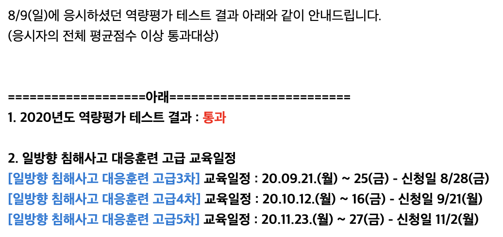

(수정중)  
  
제목은 사실 침해사고 고급과정 입소를 위한 역량평가 테스트입니다   
__일방향 침해사고 대응 고급__ 과정부터는 시험을 통과해야 교육을 들을수 있어요!   
그런데 문제가 정말 어렵습니다..  
풀수없는 몇몇 문제들을 보면서  
지식의 밑바닥을 체험해보는 시험이였습니다  
올해는 중급1차 수료자에 한해서만 고급1차를 그냥 들을수있었는데  
이기회를 날려버려서 여러번 후회하고 있었던터라 역량평가 합격이 너무 기뿌군요  
이번 테스트는 Nexon(네 그 넥슨 맞습니다), 국방부 등등에서 오셔서 기대안하고 있었거든요
원래 계획은 계속 테스트를 보면서  
아 시험당 모르는것 5문제씩만 알아가자  
였는데 이번에 운좋게도 통과를 하였습니다  
  
고급과정 역량평가 팁들을 알려드리겠습니다  
  
이런것도 알아야해? 하는 문제들이 나올텐데  
사실 그보다는 핵심 문제들이 있고 이것들을 푸느냐 못푸느냐가 당락을 가루는 기준인것 같습니다  
(허들식?)  
..

-----

-----
