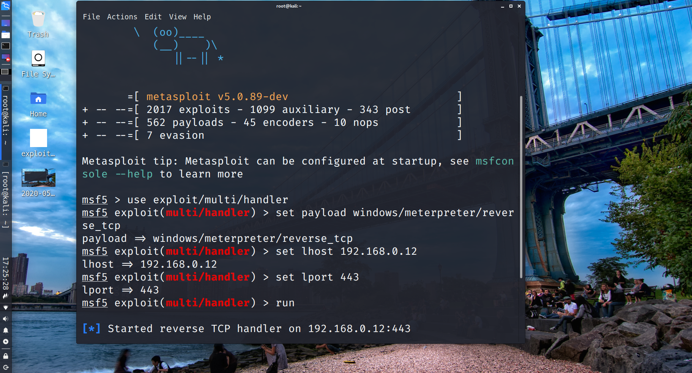

__2020년 1차 수업은__   
지작사 장교(소령(진)), 사이버사 군무원  
보안 실무자, 케이쉴드 주니어  
구직자, 취준생, 대학생  
프리랜서  
다양한 분들이 오셨는데  
제팀은  케이쉴드 주니어 친구들 셋과 보안 컨설턴트 한 분,  
그리고 42 Seoul 출신은 저 혼자였어요.  
팀은 정해져 있는것이 아니고 선착순으로 잡는거라서   
일찍 가시면 원하는 사람들, 원하는 팀과 함께 할수있어요.   
저는 운좋게도 비슷한 나이대의 좋은사람들을 만났네요.   

채팅 기능이 있어  
다른팀 사람들과 대화하며 지루하지않고 재밌게 수업을 받을수 있어요.  
  
__시스템 자원__   
5인 1팀   
1팀당 대형 모니터 1대   
1명당 모니터 3대   
1명당 외부 ip 1할당, 내부 인트라 ip 1할당   
  
__꿀팁__  
관리자PC에서 교육생PC로 접속할 수 있고 역으로(?) 접속할 수도 있습니다.  
이를 잘이용하면 관리자PC로 진입하여 교안, 논문 등의 자료를 받을 수 있습니다.  
고려대 정보보호학부 교수님들께서 공격벡터 관해 작성한 논문이 있는데,   
꼭 읽어보는걸 추천.  
  
네트워크 스캔은 이렇게  

